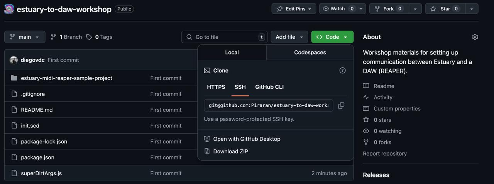

# MIDI Communication between Estuary & REAPER

- [MIDI Communication between Estuary \& REAPER](#midi-communication-between-estuary--reaper)
  - [Introduction](#introduction)
  - [Preparatory installation](#preparatory-installation)
  - [Running the sample project.](#running-the-sample-project)
- [Troubleshooting](#troubleshooting)
  - [Nothing appears on the `SuperDirtSocket` terminal window](#nothing-appears-on-the-superdirtsocket-terminal-window)
  - [Only a few messages arrive to the DAW:](#only-a-few-messages-arrive-to-the-daw)

## Introduction

Sending MIDI from Estuary to a DAW like REAPER is a reliable process but requires us to set up a communication pathway that goes from Estuary to `SuperCollider` and the from there to your DAW of choice.

In this project we will be using REAPER as our DAW of choice. While not free, REAPER, can be used without limitations before buying. We will also he using a number of free virtual instruments. However the workflow should work for any DAW and virtual instrument.

The files in this repository contain a sample REAPER project as well as the code required to run the bridge.

## Preparatory installation

1. This repository

   To install this repository click con the green "Code" button. Then click on "Download Repository". Afterwards decompress the zip at your preferred location.
   

2. `SuperCollider` - A synthesis server, language and integrated development environment (IDE).

   To install `SuperCollider` please follow the instructions [here](https://supercollider.github.io/downloads).

3. `SuperDirt` - A `SuperCollider` extension that handles [TidalCycles](https://tidalcycles.org/)/MiniTidal messages to produce sound or send midi messages elsewhere.

   To install `SuperDirt` run the following line in the `SuperCollider` IDE:

   ```supercollider
   include("SuperDirt");
   ```

4. Vowel Quark - A `SuperCollider` extension that contains vowel-like filter (required by `SuperDirt`).

   To install the quark run the follwing line in the `SuperCollider` IDE:

   ```supercollider
   Quarks.install("https://github.com/supercollider-quarks/Vowel");
   ```

5. SC3 Plugins (optional) - A suite of `SuperCollider` extensions, useful for extra synths made available in `SuperCollider` for Estuary's `MiniTidal`.

   To install the plugins you can download the build for your OS [here](https://supercollider.github.io/sc3-plugins/).

6. `Node.js` - A JavaScript environment necessary to run `SuperDirtSocket` (read below).

   To install follow the instructions [here](https://nodejs.org/en/download).

7. `SuperDirtSocket` - In charge of communicating [OSC messages](https://en.wikipedia.org/wiki/Open_Sound_Control) (containing audio event data) coming from Estuary to `SuperCollider`.

   This repository is already setup to use `SuperDirt` socket (more instructions below). For use elsewhere places, please refer to [these instructions](https://github.com/piraran/superDirtSocket).

8. REAPER (OPTIONAL for the sample project, but feel free to substitute for your DAW of choice).

   For [installing REAPER](https://www.reaper.fm/download.php).

9. Free and Open Source virtual instruments used in the sample project (OPTIONAL - you can substitue these synths for any of you choice):

   We are using [JoepVanlier's JSFX REAPER Extensions](https://github.com/JoepVanlier/JSFX), they are easy and intuitive to use. For installation instructions click [here](https://github.com/JoepVanlier/JSFX?tab=readme-ov-file#installation-instructions). You will only need to install the following synths from the Joep's extensions:

   - Yutani - Bass synth
   - Partials - Modal synthesis effect
   - DD-101 - Basic synthesis-based drum machine

## Running the sample project.

1. Using your terminal navigate to the project's folder:

   ```sh
   cd ~/path/to/this/project
   ```

2. In the terminal install `SuperDirtSocket` in the current directory (you only to do this once):

   ```sh
   npm install
   ```

3. In the same terminal run `SuperDirtSocket` and leave it open:

   ```sh
   npx superDirtSocket --superCollider 57120 -v
   ```

   When sound event data arrives from Estuary, you will be able to see it logged in here.

4. Open this repository's `init.scd` file on the `SuperCollider` IDE.

5. Run the script by placing the cursor inside the `( ... )` (parenthesis block, e.g. somewhere between lines 1 and 12) and press `ctrl+Enter` (on Linux and Windows) or `cmd+Enter` (on MacOS).

6. Open Estuary and go to settings (the `?` icon). Uncheck the `WebDirt` option and check the `SuperDirt`. This ensures events are sent and processed by `SuperCollider` (as `WebDirt` can't generate MIDI).

7. On Estuary, select the `minitidal` language on different boxes and run something like this on each one:

   ```haskell
   -- Synth
   every 16 (# note "-55") $ every 5 (|+| note "-2 -4 -5 -7") $ every 2 (sometimes $ fast 2) $ every 3 (#note "12 10 12 14") $ jux (slow 2) $ s "mididevice(<5 7 4 3>,8)" # pI "midichan" "0" # note "0 3 0 -2 -4 -5"
   ```

   ```haskell
   -- Piano
   every 4 (+ note 7) $ sometimes (echo 5 2 0.5) $ degradeBy 0.2 $ every 2 (fast 2) $ jux (rev . (+ note 12))  $ note "[2 3 8 7 5 [8 12 14]]" # s "mididevice" # pI "midichan" "1" # pF "amp" (range 0.1 0.8 $ perlin)
   ```

   ```haskell
   -- 808
   -- 808 note map: kick=0, snare=2, clap=4, hi-hats=5&6, ride=7, hi-tom=8, mid-tom=9, low-tom=10, rim=11, cowbell=12

   stack[
   slow 2 $ note "0",
   every 2 (fast 2) $ note "~ <2 4 2>"  # pF "amp"  1,
   degradeBy 0.1 $ every 3 (rev) $ note "5* 5 <5 6>*3 6 5*2 5" # pF "amp"  "[0.5 | 0.3 | 0.7 0.5 0.2]",
   degradeBy 0.3 $ note "~ <8 8 8? 12*<10 5>>" # pF "amp"  "[0.5 | 0.3 | 0.8]",
   every 8 (# note "7")  $ pF "amp" "<1 0.7>"
   ]
   # s "mididevice" # pI "midichan" "2"
   ```

   ```haskell
   -- Bass
   every 2 (fast 2)  $ note "<<0 0 0 0 12> 7*<1 2>>" + note "-24" # s "mididevice" # pI "midichan" "3"
   ```

   On terminal running `SuperDirtSocket` you should see something like:

   ```js
   {
     midichan: 0,
     note: 0,
     s: 'mididevice',
     whenPosix: 1748444957.0760503,
     when: 1748444957.0760503
   }
   ```

   Note the use of `mididevice` and refer to `init.scd` for details about this.

   **Please note that due to the browser's limitations, the browser window should be on the same desktop as your DAW, otherwise the Estuary will be put to sleep by the browser and you may not see any messages logged in the terminal.**

8. Open the sample REAPER project in the `estuary-midi-reaper-sample-project` directory.

   At this point music should already be generated by the project. If not, ensure that the "JoepVanlier's JSFX REAPER Extensions" have been installed (explained above).

   **NOTE: If you choose to use your own DAW, you should set up your tracks so that they receive MIDI input from your configured device (in `init.scd`). The sample `MiniTidal` lines will send different instrument data to channels 1-4.**

# Troubleshooting

## Nothing appears on the `SuperDirtSocket` terminal window

On Estuary, make sure that the `WebDirt` option is turned of and the `SuperDirt` option is turned on.

## Only a few messages arrive to the DAW:

The Estuary window/tab needs to be visible to you (i.e. on the same "desktop" the you are working on, and Estary's tab should be selected).
